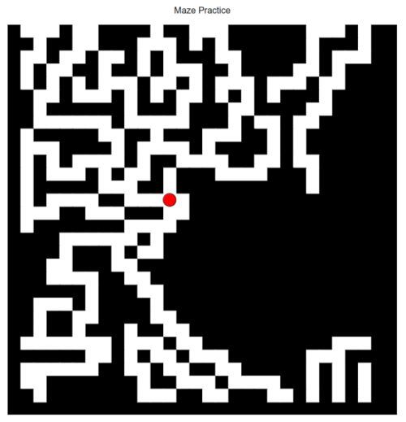

# Infinite Maze Contraption

This was an early experiment for top-down game maps. It was the basis for the more-complex maps in my Java and now C++ game experiments.

Infinite Maze Contraption is a simple maze which constantly auto-generates as the user travels up the screen. Adaptations of this software could concievably be used for more dynamic mazes or top-down games.

It's based on a flowing grid of blocks (which overlays a static matrix of points), where each block may either be a floor or a wall.

In the current version, 0.9, it basically creates a bucket where the bottom, left, and right are inaccessible, but the top continues forever.

The developer may conveniently change the number of blocks per side of the square maze by simply changing a single number value in the appropriate variable.

The actual maze-size is three times taller than what appears on the screen, as new rows of blocks are generated off-screen for reasons of visual continuity.

The original file was written by Matthew Payne in 2014.